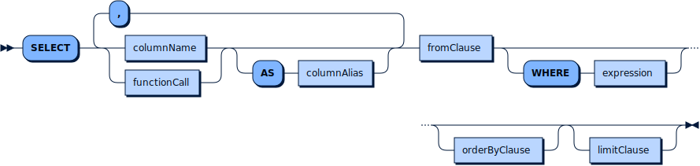

# SELECT keyword

## Syntax




## Example Queries

1. Search frames with a car

```mysql
SELECT id, frame FROM MyVideo WHERE ['car'] <@ FastRCNNObjectDetector(frame).labels;
```
2. Search frames with a pedestrian and a car

```mysql
SELECT id, frame FROM MyVideo WHERE ['pedestrian', 'car'] <@ FastRCNNObjectDetector(frame).labels;
```


```mysql
SELECT id, frame FROM MyVideo WHERE array_count(FastRCNNObjectDetector(frame).labels, 'car') > 3;
```

3. Search frames containing greater than 3 cars

```mysql
SELECT id, frame FROM DETRAC WHERE array_count(FastRCNNObjectDetector(frame).labels, 'car') > 3;
```
