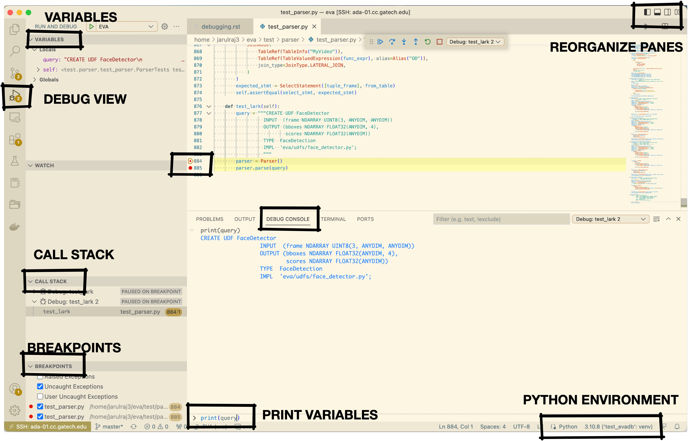

Debugging
-----

We recommend Visual Studio Code with a debugger for debugging EVA. This tutorial presents a detailed step-by-step process of using the debugger.

Setup debugger
====

1. Install the `Python extension <https://marketplace.visualstudio.com/items?itemName=ms-python.python>`__ in Visual Studio Code.

2. Install the `Python Test Explorer extension <https://marketplace.visualstudio.com/items?itemName=LittleFoxTeam.vscode-python-test-adapter>`__.

3. Follow these instructions to run a particular test case from the file:
`Getting started <https://github.com/kondratyev-nv/vscode-python-test-adapter>`__.

.. image:: images/eva-debug-1.jpg
   :width: 1200

Alternative: Manually Setup Debugger for EVA
====

When you press the debug icon, you will be given an option to create a ``launch.json`` file.

While creating the JSON file, you will be prompted to select the environment to be used. Select the python environment from the ``command palette`` at the top. If the Python environment cannot be seen in the drop-down menu, try installing the python extension, and repeat the process.

Once you select the python environment, a ``launch.json`` file will be created with the default configurations set to debug a simple .py file.

More configurations can further be added to the file, to modify the environment variables or to debug an entire folder or workspace directory. Use the following configuration in the JSON file:

.. code-block:: json

   {

       "version": "0.2.0",
       "configurations": [

          {
               "name": "Python: test_pytorch.py",
               "type": "python",
               "request": "launch",
               "program": "${workspaceFolder}/test/integration_tests/test_pytorch.py",
               "console": "integratedTerminal",
               "cwd": "${workspaceFolder}",
               "env": {"PYTHONPATH": "${workspaceRoot}"}
           }

       ]
   }

You can modify the fields of the above JSON file as follows:
    
    ``name``: It is the reader-friendly name to appear in the Debug launch
    configuration dropdown.
    
    ``type``: The type of debugger to use for this launch configuration.
    
    ``program``: The executable or file to run when launching the debugger.
    In the above example, test_integration.py will be executed by the
    debugger.
    
    ``env``: Here you specify the environment variables. In the above
    example, the path for the conda environment for Eva has been specified.

Using these configuration variables, you can run the debugger both locally as
well as on a remote server.
