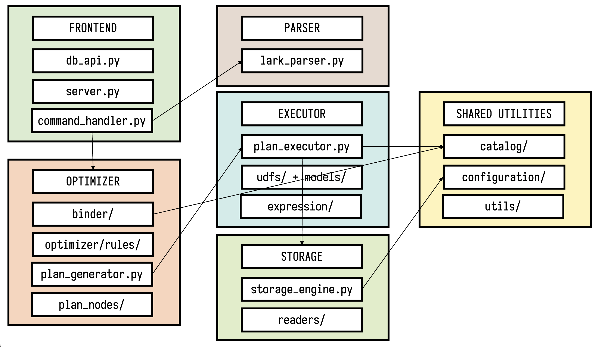

Contributing
----

We welcome all kinds of contributions to EVA.

-  `Code reviews <https://github.com/georgia-tech-db/eva/pulls>`_
-  `Improving documentation <https://github.com/georgia-tech-db/eva/tree/master/docs>`_
-  `Tutorials and applications <https://github.com/georgia-tech-db/eva/tree/master/tutorials>`_
-  New features

Setting up the Development Environment
=====

First, you will need to checkout the repository from GitHub and build EVA from
the source. Follow the following instructions to build EVA locally. We recommend using a virtual environment and the pip package manager. 

.. code-block:: bash

   git clone https://github.com/georgia-tech-db/eva.git && cd eva
   python3 -m venv test_eva_db       # create a virtual environment
   source test_eva_db/bin/activate   # activate the virtual environment
   pip install --upgrade pip         # upgrade pip
   pip install -e ".[dev]"           # build and install the EVA package
   bash script/test/test.sh          # run the eva EVA suite
   
After installing the package locally, you can make changes and run the test cases to check their impact.

.. code-block:: bash

   pip install .         # reinstall EVA package to include local changes 
   pkill -9 eva_server   # kill running EVA server (if any)
   eva_server&           # launch EVA server with newly installed package

Testing
====

Check if your local changes broke any unit or integration tests by running the following script:

.. code-block:: bash

   bash script/test/test.sh

If you want to run a specific test file, use the following command.

.. code-block:: bash

   python -m pytest test/integration_tests/test_select_executor.py

Use the following command to run a specific test case within a specific test
file.

.. code-block:: bash

   python -m pytest test/integration_tests/test_select_executor.py -k 'test_should_load_and_select_in_table'

Submitting a Contribution
====

Follow the following steps to contribute to EVA:

-  Merge the most recent changes from the master branch

.. code-block:: bash

       git remote add origin git@github.com:georgia-tech-db/eva.git
       git pull . origin/master

-  Run the `test script <#testing>`__ to ensure that all the test cases pass.
-  If you are adding a new EVAQL command, add an illustrative example usage in 
   the `documentation <https://github.com/georgia-tech-db/eva/tree/master/docs>`_.
- Run the following command to ensure that code is properly formatted.

.. code-block:: python

      python script/formatting/formatter.py 

Code Style
====

We use the `black <https://github.com/psf/black>`__ code style for
formatting the Python code. For docstrings and documentation, we use
`Google Pydoc format <https://sphinxcontrib-napoleon.readthedocs.io/en/latest/example_google.html>`__.

.. code-block:: python

   def function_with_types_in_docstring(param1, param2) -> bool:
       """Example function with types documented in the docstring.

       Additional explanatory text can be added in paragraphs.

       Args:
           param1 (int): The first parameter.
           param2 (str): The second parameter.

       Returns:
           bool: The return value. True for success, False otherwise.

Debugging
====

We recommend using Visual Studio Code with a debugger for developing EVA. Here are the steps for setting up the development environment:

1. Install the `Python extension <https://marketplace.visualstudio.com/items?itemName=ms-python.python>`__ in Visual Studio Code.

2. Install the `Python Test Explorer extension <https://marketplace.visualstudio.com/items?itemName=LittleFoxTeam.vscode-python-test-adapter>`__.

3. Follow these instructions to run a particular test case from the file:
`Getting started <https://github.com/kondratyev-nv/vscode-python-test-adapter#getting-started>`__.

.. image:: images/eva-debug-1.jpg
   :width: 1200

.. image:: images/eva-debug-2.jpg
   :width: 1200

Architecture Diagram
====

Troubleshooting
====

If the test suite fails with a `PermissionDenied` exception, update the `path_prefix` attribute under the `storage` section in the EVA configuration file (``~/.eva/eva.yml``) to a directory where you have write privileges.
