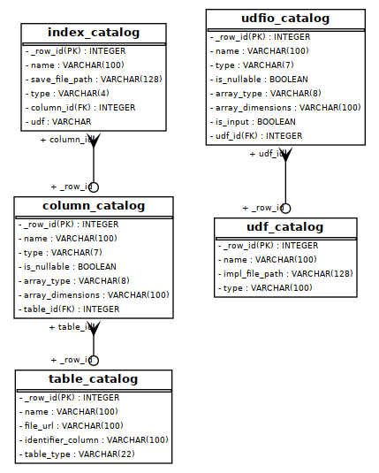

Catalog
=======

Catalog Manager
---------------

Explanation for developers on how to use the eva `catalog_manager <https://github.com/georgia-tech-db/eva/blob/076704705c35245a6c83a626dba599342c59ff64/eva/catalog/catalog_manager.py#L44>`_.

CatalogManager class that provides a set of services to interact with a database that stores metadata about tables, columns, and user-defined functions (UDFs). Information like what is the data type in a certain column in a table, type of a table, its name, etc.. It contains functions to get, insert and delete catalog entries for Tables, UDFs, UDF IOs, Columns and Indexes.  

This data is stored in the eva_catalog.db file which can be found in `~/.eva/<version>/` folder.  

Catalog manager currently has 5 services in it:  

.. code:: python

    TableCatalogService()  
    ColumnCatalogService()   
    UdfCatalogService()   
    UdfIOCatalogService()   
    IndexCatalogService()   

Catalog Services
----------------

This class provides functionality related to a table catalog, including inserting, getting, deleting, and renaming table entries, as well as retrieving all entries. e.g. the TableCatalogService contains code to get, insert and delete a table. 

Catalog Models
--------------

These contain the data model that is used by the catalog services.  
Each model represents a table in the underlying database.

|pic1|
