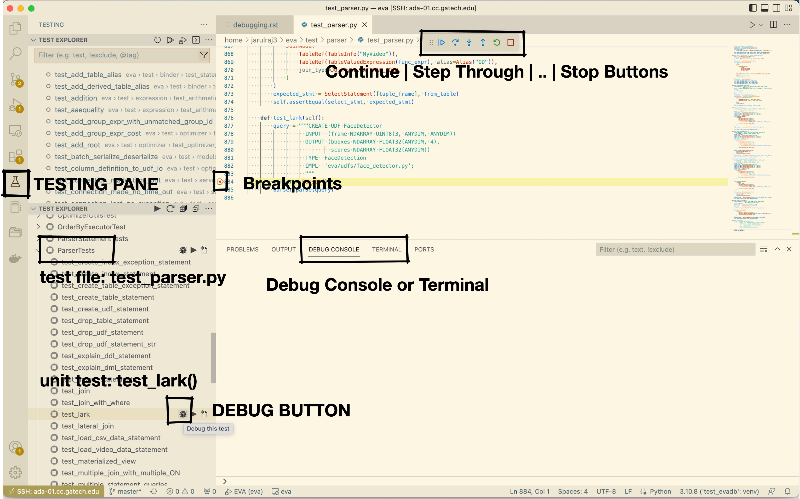

Setup VSCode Debugger
=====================

1. Install the `Python extension <https://marketplace.visualstudio.com/items?itemName=ms-python.python>`__ in Visual Studio Code.

2. Install the `Python Test Explorer extension <https://marketplace.visualstudio.com/items?itemName=LittleFoxTeam.vscode-python-test-adapter>`__.

3. Follow these instructions to run a particular test case from the file:
`Getting started <https://github.com/kondratyev-nv/vscode-python-test-adapter>`__.

.. image:: ../images/evadb-debug-2.jpg
   :width: 1200